# CRNN_Tensorflow
This is a TensorFlow implementation of a Deep Neural Network for scene 
text recognition. It is  mainly based on the paper 
["An End-to-End Trainable Neural Network for Image-based Sequence Recognition and Its Application to Scene Text Recognition"](http://arxiv.org/abs/1507.05717). 
You can refer to the paper for architecture details. Thanks to 
the author [Baoguang Shi](https://github.com/bgshih).
  
The model consists of a CNN stage extracting features which are fed 
to an RNN stage (Bi-LSTM) and a CTC loss.

## Installation

This software has been developed on Ubuntu 16.04(x64) using python 3.5 and 
TensorFlow 1.12. Since it uses some recent features of TensorFlow it is 
incompatible with older versions.

The following methods are provided to install dependencies:

### Conda

You can create a conda environment with the required dependencies using: 

```
conda env create -f crnntf-env.yml
```

### Pip

Required packages may be installed with

```
pip3 install -r requirements.txt
```

## Testing the pre-trained model

### Evaluate the model on the synth90k dataset
In this repo you will find a model pre-trained on the 
[Synth 90k](http://www.robots.ox.ac.uk/~vgg/data/text/)dataset. When the tfrecords
file of synth90k dataset has been successfully generated you may evaluated the
model by the following script

The pretrained crnn model weights on Synth90k dataset can be found
[here](https://www.dropbox.com/sh/y4eaunamardibnd/AAB4h8NkakASDoc6Ek4knEGIa?dl=0)

```
python tools/evaluate_shadownet.py --dataset_dir PATH/TO/YOUR/DATASET_DIR 
--weights_path PATH/TO/YOUR/MODEL_WEIGHTS_PATH
--char_dict_path PATH/TO/CHAR_DICT_PATH 
--ord_map_dict_path PATH/TO/ORD_MAP_PATH
--process_all 1 --visualize 1
```

If you set visualize true the expected output during evaluation process is

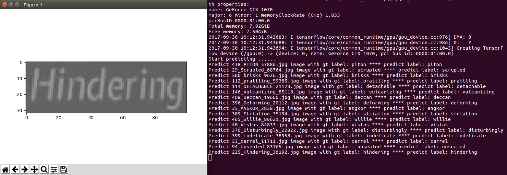

After all the evaluation process is done you should see some thing like this:

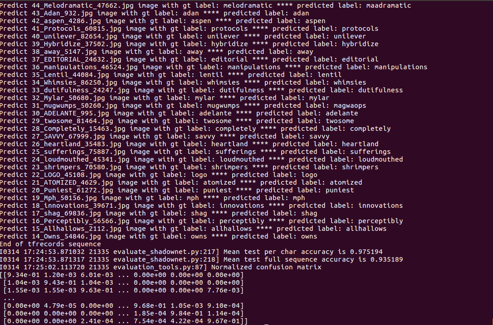

The model's main evaluation index are as follows:

**Test Dataset Size**: 891927 synth90k test images

**Per char Precision**: 0.974325 without average weighted on each class

**Full sequence Precision**: 0.932981 without average weighted on each class

For Per char Precision:

single_label_accuracy = correct_predicted_char_nums_of_single_sample / single_label_char_nums

avg_label_accuracy = sum(single_label_accuracy) / label_nums

For Full sequence Precision:

single_label_accuracy = 1 if the prediction result is exactly the same as label else 0

avg_label_accuracy = sum(single_label_accuracy) / label_nums

Part of the confusion matrix of every single char looks like this:

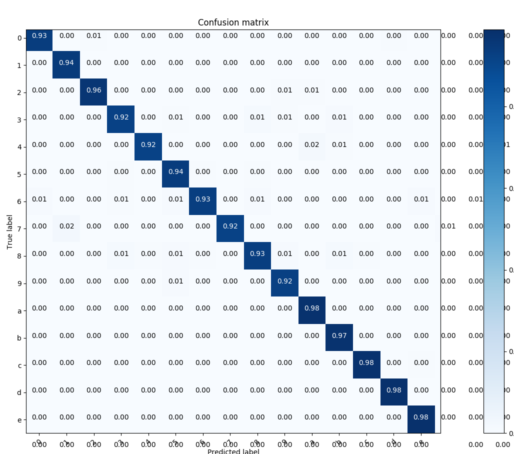


### Test the model on the single image

If you want to test a single image you can do it with
```
python tools/test_shadownet.py --image_path PATH/TO/IMAGE 
--weights_path PATH/TO/MODEL_WEIGHTS
--char_dict_path PATH/TO/CHAR_DICT_PATH 
--ord_map_dict_path PATH/TO/ORD_MAP_PATH
```

### Test example images

Example test_01.jpg
 
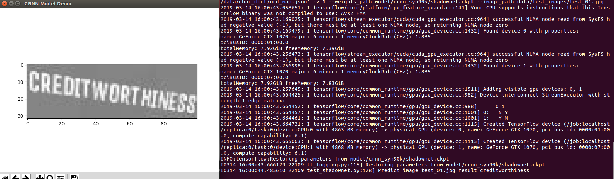  

Example test_02.jpg

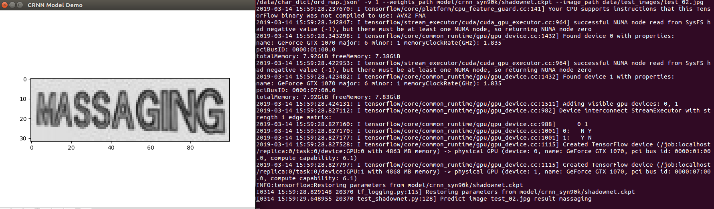  

Example test_03.jpg

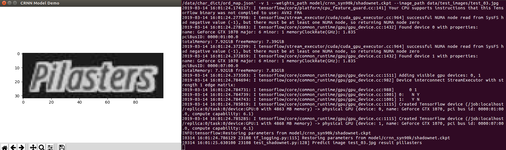 

## Training your own model

#### Data preparation
Download the whole synth90k dataset [here](http://www.robots.ox.ac.uk/~vgg/data/text/)
And extract all th files into a root dir which should contain several txt file and
several folders filled up with pictures. Then you need to convert the whole 
dataset into tensorflow records as follows

```
python tools/write_tfrecords 
--dataset_dir PATH/TO/SYNTH90K_DATASET_ROOT_DIR
--save_dir PATH/TO/TFRECORDS_DIR
```

During converting all the source image will be scaled into (32, 100)

#### Training

For all the available training parameters, check `global_configuration/config.py`, 
then train your model with

```
python tools/train_shadownet.py --dataset_dir PATH/TO/YOUR/TFRECORDS
--char_dict_path PATH/TO/CHAR_DICT_PATH 
--ord_map_dict_path PATH/TO/ORD_MAP_PATH
```

If you wish, you can add more metrics to the training progress messages with 
`--decode_outputs 1`, but this will slow
training down. You can also continue the training process from a snapshot with

```
python tools/train_shadownet.py --dataset_dir PATH/TO/YOUR/TFRECORDS
--weights_path PATH/TO/YOUR/PRETRAINED_MODEL_WEIGHTS
--char_dict_path PATH/TO/CHAR_DICT_PATH --ord_map_dict_path PATH/TO/ORD_MAP_PATH
```

If you has multiple gpus in your local machine you may use multiple gpu training
to access a larger batch size input data. This will be supported as follows

```
python tools/train_shadownet.py --dataset_dir PATH/TO/YOUR/TFRECORDS
--char_dict_path PATH/TO/CHAR_DICT_PATH --ord_map_dict_path PATH/TO/ORD_MAP_PATH
--multi_gpus 1

```

The sequence distance is computed by calculating the distance between two 
sparse tensors so the lower the accuracy value
is the better the model performs. The training accuracy is computed by 
calculating the character-wise precision between
the prediction and the ground truth so the higher the better the model performs.

#### Tensorflow Serving

Thanks for [Eldon's](https://github.com/eldon) contribution of tensorflow 
service function:)

Since tensorflow model server is a very powerful tools to serve the DL model in
industry environment. Here's a script for you to convert the checkpoints model file
into tensorflow saved model which can be used with tensorflow model server to serve
the CRNN model. If you can not run the script normally you may need to check if the
checkpoint file path is correct in the bash script.

```
bash tfserve/export_crnn_saved_model.sh
```

To start the tensorflow model server you may check following script

```
bash tfserve/run_tfserve_crnn_gpu.sh
```

There are two different ways to test the python client of crnn model. First you may
test the server via http/rest request by running

```
python tfserve/crnn_python_client_via_request.py ./data/test_images/test_01.jpg
```

Second you may test the server via grpc by running

```
python tfserve/crnn_python_client_via_grpc.py
```

## Experiment

The original experiment run for 2000000 epochs, with a batch size of 32, 
an initial learning rate of 0.01 and exponential
decay of 0.1 every 500000 epochs. During training the `train loss` dropped as 
follows  

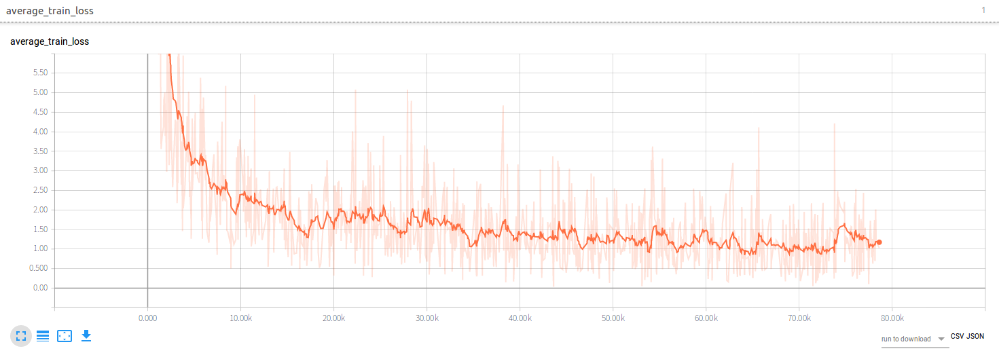

The `val loss` dropped as follows
  
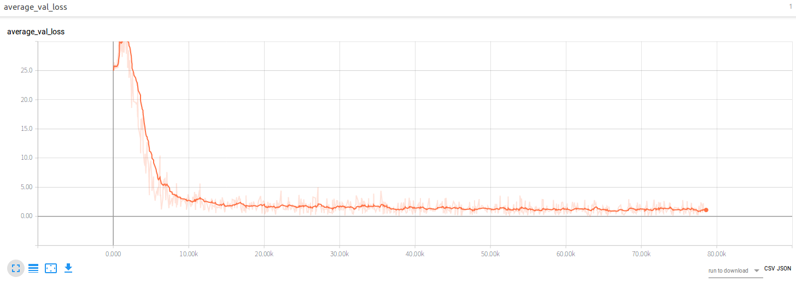

## 2019.3.27 Updates
I have uploaded a newly trained crnn model on chinese dataset which can be found
[here](https://pan.baidu.com/s/1ufYbnZAZ1q0AlK7yZ08cvQ). Sorry for not knowing 
the owner of the dataset. But thanks for his great work. If someone knows it 
you're welcome to let me know. The pretrained weights can be found 
[here](https://www.dropbox.com/sh/z22xsn4byddalv3/AAAiIxAHJKbqy44M73ow5znSa?dl=0)

Before start training you may need reorgnize the dataset's label information according 
to the synth90k dataset's format if you want to use the same data feed pip line 
mentioned above. Now I have reimplemnted a more efficient tfrecords writer which will
accelerate the process of generating tfrecords file. You may refer to the code for
details. Some information about training is listed bellow:

**image size**: (280, 32)

**classes nums**: 5824 without blank

**sequence length**: 70

**training sample counts**: 2733004

**validation sample counts**: 364401

**testing sample counts**: 546601

**batch size**: 32

**training iter nums**: 200000

**init lr**: 0.01

### Test example images

Example test_01.jpg
 
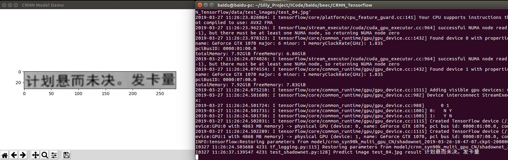  

Example test_02.jpg

  

Example test_03.jpg

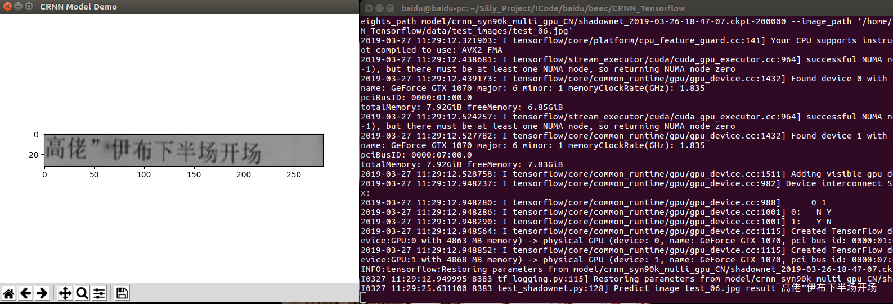 

### training tboard file

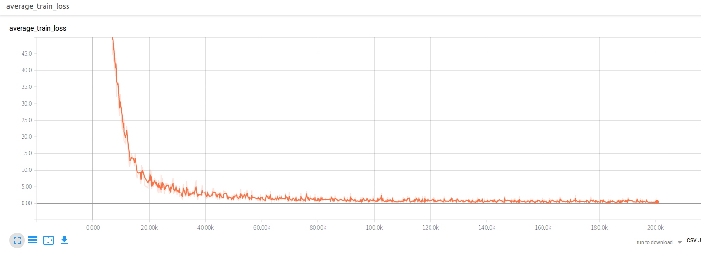

The `val loss` dropped as follows
  
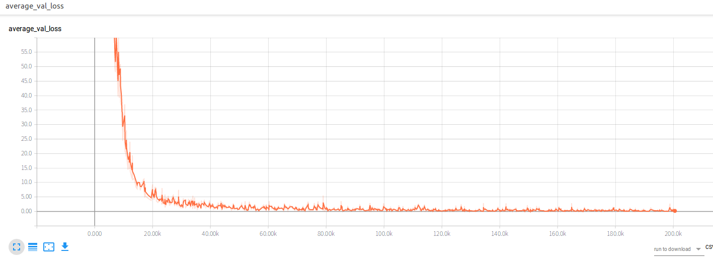

## 2019.4.10 Updates
Add a small demo to recognize chinese pdf using the chinese crnn model weights. If you
want to have a try you may follow the command:

```
cd CRNN_ROOT_REPO
python tools/recongnize_chinese_pdf.py -c ./data/char_dict/char_dict_cn.json 
-o ./data/char_dict/ord_map_cn.json --weights_path model/crnn_chinese/shadownet.ckpt 
--image_path data/test_images/test_pdf.png --save_path pdf_recognize_result.txt
```

You should see the same result as follows:

The left image is the recognize result displayed on console and the right 
image is the origin pdf image.

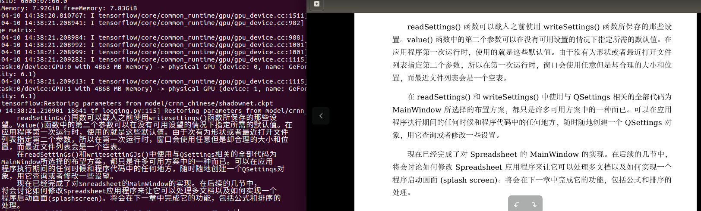

The left image is the recognize result written in local file and the right 
image is the origin pdf image.
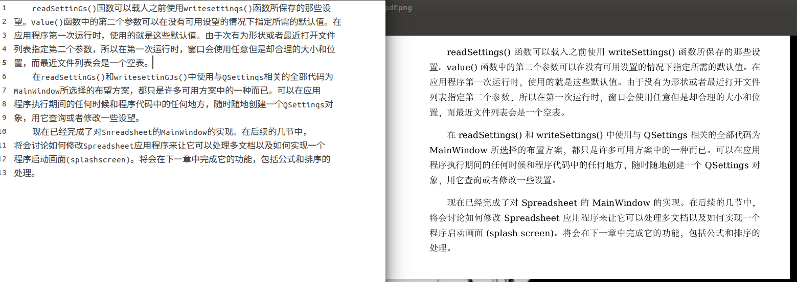

## TODO

- [x] Add new model weights trained on the whole synth90k dataset
- [x] Add multiple gpu training scripts
- [x] Add new pretrained model on chinese dataset
- [ ] Add an online toy demo
- [x] Add tensorflow service script
